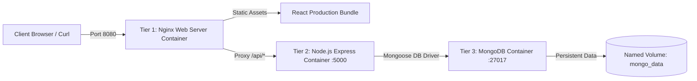

# Docker Containerized MERN Web Server Application

> **Task 4: Web Server using Docker**  
> Complete implementation of a containerized full-stack MERN application (MongoDB, Express, React, Node.js) featuring an **Nginx Web Server** reverse proxy, automated health monitoring, container lifecycle management, and deployment best practices.

---

## 🏛️ Architecture Overview

The application is architected into 3 decoupled tiers running on an isolated Docker bridge network:



1. **Web Server Tier (`client`)**:
   - **Nginx Alpine**: Serves the compiled React Vite application and acts as an API reverse proxy.
   - **Multi-Stage Build**: Compiles React in Node 20, then outputs only static files into a 25MB Nginx image.
   - **Port**: Host `8080` -> Container `80`.

2. **Backend API Tier (`server`)**:
   - **Express REST API**: Serves endpoints for task management and healthchecks (`/api/health`, `/api/tasks`).
   - **Security**: Runs under non-root user `node`.
   - **Port**: Internal `5000` (accessible only through Nginx or internal network).

3. **Database Tier (`mongodb`)**:
   - **MongoDB 6.0**: Stores collections with automated seeding on initial startup.
   - **Data Persistence**: Backed by named volume `mongo_data`.
   - **Port**: Internal `27017` (isolated from public host access).

---

## 🚀 Quick Start Guide

### 1. Build and Start All Containers
Run from the project root directory:
```powershell
docker compose up -d --build
```

### 2. Verify Container Status & Health
```powershell
docker compose ps
```
You should see all three containers (`mern-client`, `mern-server`, `mern-mongodb`) in a `healthy` or `running` state.

### 3. Open the Application
- **Web Server Dashboard**: Open your browser at [http://localhost:8080](http://localhost:8080)
- **Direct Healthcheck Endpoint**: [http://localhost:8080/api/health](http://localhost:8080/api/health)
- **Nginx Native Health**: [http://localhost:8080/nginx-health](http://localhost:8080/nginx-health)

---

## 🛠️ Container Lifecycle & Management Cheatsheet

| Action | Command | Purpose |
| :--- | :--- | :--- |
| **Start Containers** | `docker compose up -d` | Run all containers in the background |
| **Rebuild Containers** | `docker compose up -d --build` | Recompile and recreate containers |
| **List Status** | `docker compose ps` | Check container IDs, status, and ports |
| **View Live Logs** | `docker compose logs -f` | Follow logs across all containers |
| **View Service Logs** | `docker compose logs -f server` | Follow logs for Express API |
| **Stop Containers** | `docker compose stop` | Pause services without deleting data |
| **Restart a Service** | `docker compose restart client` | Reload Nginx configuration or frontend |
| **Terminal Access** | `docker exec -it mern-server sh` | Open interactive shell inside backend |
| **Tear Down** | `docker compose down` | Stop and remove containers and network |
| **Complete Reset** | `docker compose down -v` | Stop containers AND delete MongoDB volume |

---

## 📊 Monitoring Container Health & Performance

### 1. Live Resource Consumption
To inspect live CPU, Memory, Network I/O, and PID metrics for each container:
```powershell
docker stats --no-stream
```

### 2. Detailed Health Inspection
To examine Docker's automated health check log:
```powershell
docker inspect --format='{{json .State.Health}}' mern-server
```

---

## 📚 Complete Learning Guides (Docs)

Detailed guides covering every syllabus item are included in the [`docs/`](file:///c:/Users/ASUS/Downloads/IntenShip%20Project%201/docs) folder:
- [01. Docker Containerization Basics](file:///c:/Users/ASUS/Downloads/IntenShip%20Project%201/docs/01_docker_basics.md)
- [02. Container Lifecycle & Commands Cheatsheet](file:///c:/Users/ASUS/Downloads/IntenShip%20Project%201/docs/02_lifecycle_commands.md)
- [03. Health Monitoring & Troubleshooting](file:///c:/Users/ASUS/Downloads/IntenShip%20Project%201/docs/03_health_monitoring.md)
- [04. Deployment Best Practices](file:///c:/Users/ASUS/Downloads/IntenShip%20Project%201/docs/04_best_practices.md)
