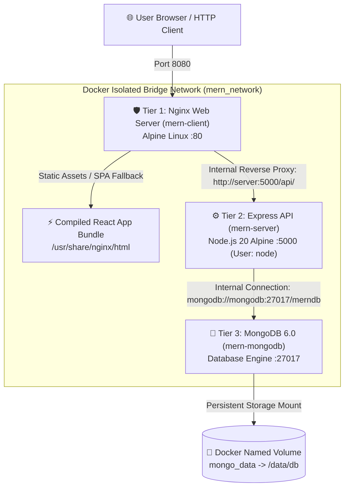

# 🐳 Web Server using Docker: Production MERN Stack Architecture

[](https://www.docker.com/)
[](https://nginx.org/)
[](https://nodejs.org/)
[](https://expressjs.com/)
[](https://reactjs.org/)
[](https://vitejs.dev/)
[](https://www.mongodb.com/)
[](https://opensource.org/licenses/MIT)

> **Task 4: Web Server using Docker**  
> A production-ready, enterprise-grade containerized MERN (MongoDB, Express, React, Node.js) full-stack web application featuring an **Nginx Web Server reverse proxy**, multi-stage container builds, automated health checks, security hardening (non-root execution), and zero-downtime container orchestration.

---

## 📑 Table of Contents

- [Key Features](#-key-features)
- [System Architecture](#-system-architecture)
- [Directory Structure](#-directory-structure)
- [Tech Stack & Prerequisites](#-tech-stack--prerequisites)
- [Quick Start Guide](#-quick-start-guide)
- [Environment Configuration](#-environment-configuration)
- [API Reference](#-api-reference)
- [Docker Architecture Deep-Dive](#-docker-architecture-deep-dive)
  - [Multi-Stage Client Build](#1-multi-stage-client-build-react--nginx)
  - [Hardened Backend Container](#2-hardened-backend-container-nodejs--express)
  - [Nginx Reverse Proxy & Security Headers](#3-nginx-reverse-proxy--security-headers)
  - [Service Health Orchestration](#4-service-health-orchestration)
- [Container Lifecycle Cheatsheet](#-container-lifecycle-cheatsheet)
- [Monitoring & Diagnostics](#-monitoring--diagnostics)
- [Troubleshooting Guide](#-troubleshooting-guide)
- [Documentation Suite](#-documentation-suite)
- [License & Acknowledgments](#-license--acknowledgments)

---

## ✨ Key Features

- **Decoupled 3-Tier Microservices Architecture**: Web Server / Reverse Proxy, Application API, and Persistent Database tiers run in isolated, dedicated Docker containers.
- **Nginx Web Server Reverse Proxy**: Handles static asset delivery with gzip compression, high-performance HTTP caching headers, and proxies `/api/*` requests internally to the Express backend.
- **Multi-Stage Dockerfile Builds**: Compiles the React Vite application in a Node.js builder stage and transfers only the production static distribution into a lightweight Alpine Nginx image (reducing image size to ~25MB).
- **Security Hardening & Principle of Least Privilege**:
  - The Express container runs under a dedicated, unprivileged non-root user (`node`).
  - Security headers enforced at the Nginx edge (`X-Frame-Options`, `X-Content-Type-Options`, `X-XSS-Protection`, `Referrer-Policy`).
  - Database port `27017` and backend port `5000` are completely hidden from public host access, reachable only through the internal Docker bridge network.
- **Automated Health Monitoring & Dependency Gating**:
  - Native health checks configured for MongoDB, Express API, and Nginx.
  - Startup dependency checks (`condition: service_healthy`) prevent API boot-up until MongoDB passes health checks.
- **Graceful Shutdown**: The Express API intercepts `SIGTERM` and `SIGINT` signals to close active HTTP connections and database pools cleanly.
- **Data Persistence**: MongoDB utilizes a named Docker volume (`mongo_data`) ensuring collections persist across container restarts, stops, and rebuilds.
- **Interactive UI Dashboard**: Real-time interactive dashboard displaying container metrics, MongoDB connection status, system uptime, and live task CRUD management.

---

## 🏛️ System Architecture

All services operate on a private Docker bridge network (`mern_network`) with internal DNS resolution:



### Tier Specifications

| Tier | Container Name | Base Image | Exposed Ports | Role & Key Responsibilities |
| :--- | :--- | :--- | :--- | :--- |
| **Web Server & UI** | `mern-client` | `nginx:alpine` | Host `8080` $\rightarrow$ Container `80` | Serves compiled React app, gzip compression, asset caching, routes `/api/*` to backend |
| **Application API** | `mern-server` | `node:20-alpine` | `5000` (Internal only) | Express REST API, health endpoint, CRUD business logic, runs as non-root `node` user |
| **Database Tier** | `mern-mongodb` | `mongo:6.0` | `27017` (Internal only) | Stores application collections, runs background ping health checks, persists to disk |

---

## 📁 Directory Structure

```
Web-Server-using-Docker/
├── .env.example               # Template environment configuration file
├── .gitignore                  # Git ignore rules (ignores .env, node_modules, logs)
├── docker-compose.yml          # Multi-container orchestration specification
├── README.md                   # Complete project documentation
│
├── client/                     # Frontend & Nginx Web Server Tier
│   ├── .dockerignore           # Excludes node_modules, build artifacts from Docker build
│   ├── Dockerfile              # Multi-stage build (Node builder -> Nginx Alpine runtime)
│   ├── nginx.conf              # Custom Nginx configuration (reverse proxy, gzip, security)
│   ├── index.html              # HTML entry point with modern metadata & Google Fonts
│   ├── package.json            # Client dependencies (React 18, Vite, Lucide icons)
│   ├── vite.config.js          # Vite build tooling configuration
│   └── src/
│       ├── App.jsx             # Interactive UI dashboard with metrics & task management
│       ├── index.css           # Modern CSS styling with glassmorphism & responsive grid
│       └── main.jsx            # React root component initialization
│
├── server/                     # Backend REST API Tier
│   ├── .dockerignore           # Excludes node_modules, logs from Docker context
│   ├── Dockerfile              # Hardened Node.js image with non-root user & health checks
│   ├── package.json            # Server dependencies (Express, Mongoose, CORS, Dotenv)
│   ├── server.js               # Express application, REST endpoints, graceful shutdown
│   └── models/
│       └── Task.js             # Mongoose Schema & validation for Task entity
│
└── docs/                       # Comprehensive Knowledge & Learning Guides
    ├── 01_docker_basics.md      # Docker containerization principles & engine mechanics
    ├── 02_lifecycle_commands.md # Complete Docker CLI & container lifecycle reference
    ├── 03_health_monitoring.md  # Docker health check strategies, logging, and metrics
    └── 04_best_practices.md    # Production deployment, security, and optimization standards
```

---

## 💻 Tech Stack & Prerequisites

### Technologies Used
- **Containerization**: Docker Engine 20.10+, Docker Compose v2+
- **Web Server / Proxy**: Nginx 1.25+ (Alpine Linux)
- **Frontend**: React 18, Vite 5, Vanilla CSS3 (Custom Design System), Lucide React Icons
- **Backend Runtime**: Node.js 20 LTS (Alpine Linux), Express.js 4
- **Database**: MongoDB 6.0 Community Edition, Mongoose 8

### Prerequisites
Before running the application, ensure you have:
1. [Docker Desktop](https://www.docker.com/products/docker-desktop/) (Windows / macOS) or Docker Engine + Docker Compose Plugin (Linux) installed and running.
2. [Git](https://git-scm.com/) installed.
3. Ports `8080` available on your host system.

---

## 🚀 Quick Start Guide

### Step 1: Clone the Repository
```bash
git clone https://github.com/swarajvecha-web/Web-Server-using-Docker.git
cd Web-Server-using-Docker
```

### Step 2: Configure Environment Variables
Create your local `.env` file from the provided template:
```bash
# On Windows PowerShell
Copy-Item .env.example .env

# On Linux / macOS
cp .env.example .env
```

### Step 3: Build and Launch All Containers
Execute Docker Compose to build the multi-stage images, initialize the internal bridge network, attach the persistent volume, and launch all services:
```bash
docker compose up -d --build
```

### Step 4: Verify Container Health
Check the real-time status of the containers:
```bash
docker compose ps
```
You should see all three services running in a healthy state:
```
NAME           IMAGE                      COMMAND                  SERVICE   STATUS              PORTS
mern-client    web-server-client          "/docker-entrypoint.…"   client    Up (healthy)        0.0.0.0:8080->80/tcp
mern-server    web-server-server          "docker-entrypoint.s…"   server    Up (healthy)        5000/tcp
mern-mongodb   mongo:6.0                  "docker-entrypoint.s…"   mongodb   Up (healthy)        27017/tcp
```

### Step 5: Access the Application
Open your web browser and navigate to:
- **Interactive Web Server Dashboard**: [http://localhost:8080](http://localhost:8080)
- **Backend API Health Check**: [http://localhost:8080/api/health](http://localhost:8080/api/health)
- **Nginx Web Server Native Health Check**: [http://localhost:8080/nginx-health](http://localhost:8080/nginx-health)
- **Container & Host System Info**: [http://localhost:8080/api/info](http://localhost:8080/api/info)

---

## ⚙️ Environment Configuration

The application is configured using environment variables defined in `.env` (or passed dynamically via Docker Compose):

| Variable | Default Value | Description |
| :--- | :--- | :--- |
| `PORT` | `5000` | Port on which the Express server listens inside the container |
| `MONGO_URI` | `mongodb://mongodb:27017/merndb` | Internal connection string using Docker DNS service name `mongodb` |
| `NODE_ENV` | `production` | Execution environment mode (enables performance optimizations) |
| `MONGO_INITDB_DATABASE` | `merndb` | Default database initialized on MongoDB first boot |

---

## 📡 API Reference

All backend endpoints are securely routed through the Nginx reverse proxy at `http://localhost:8080/api/*`.

### Health & Monitoring Endpoints

#### 1. Express API & Database Health
```http
GET /api/health
```
**Response (`200 OK`):**
```json
{
  "status": "healthy",
  "timestamp": "2026-09-20T14:15:00.000Z",
  "uptime": 124.5,
  "database": {
    "status": "Connected",
    "connected": true
  },
  "container": {
    "hostname": "4f9d8e7b1a2c",
    "platform": "linux",
    "nodeVersion": "v20.18.0",
    "memoryUsage": {
      "totalMemMb": "7912.4",
      "freeMemMb": "4210.8",
      "processHeapMb": "38.2"
    }
  }
}
```

#### 2. Nginx Web Server Native Health
```http
GET /nginx-health
```
**Response (`200 OK`):**
```json
{
  "status": "healthy",
  "server": "nginx",
  "uptime": "active"
}
```

#### 3. Container System Information
```http
GET /api/info
```
**Response (`200 OK`):**
```json
{
  "service": "Docker MERN Backend API",
  "containerHostname": "4f9d8e7b1a2c",
  "environment": "production",
  "uptimeSeconds": 124,
  "timestamp": "2026-09-20T14:15:00.000Z"
}
```

### Task Resource CRUD Endpoints

| Method | Endpoint | Description | Request Body Example | Status Code |
| :--- | :--- | :--- | :--- | :--- |
| `GET` | `/api/tasks` | Fetch all tasks (sorted by newest) | *None* | `200 OK` |
| `POST` | `/api/tasks` | Create a new task | `{"title":"Task Name","description":"Desc","category":"Docker","priority":"High"}` | `201 Created` |
| `PUT` | `/api/tasks/:id` | Update task fields / status | `{"status":"Completed"}` | `200 OK` |
| `DELETE` | `/api/tasks/:id` | Remove a task by ID | *None* | `200 OK` |

---

## 🔍 Docker Architecture Deep-Dive

### 1. Multi-Stage Client Build (React + Nginx)
Traditional single-stage Docker builds for frontends bundle the entire Node runtime, npm cache, and build tools into the final image, often exceeding 600MB+. 

Our [`client/Dockerfile`](file:///c:/Users/ASUS/Downloads/IntenShip%20Project%201/client/Dockerfile) adopts a **two-stage build pattern**:
1. **Stage 1 (`builder`)**: Uses `node:20-alpine` to install dependencies and compile the production bundle via `npm run build`.
2. **Stage 2 (`runtime`)**: Pulls an ultra-minimal `nginx:alpine` image (~25MB), copies only the compiled `/dist` directory from the builder, and discards all Node.js and build tooling.

### 2. Hardened Backend Container (Node.js + Express)
Our [`server/Dockerfile`](file:///c:/Users/ASUS/Downloads/IntenShip%20Project%201/server/Dockerfile) implements production security best practices:
- **Layer Caching**: Copies `package*.json` and runs `npm install --omit=dev` before copying source code, ensuring dependency layers are cached when code changes.
- **Non-Root Execution**: Runs under the unprivileged `USER node` to prevent root-level container breakout vulnerabilities.
- **Signal Handling**: Executes `CMD ["node", "server.js"]` as PID 1 to properly handle `SIGTERM` and `SIGINT` signals for graceful teardown.

### 3. Nginx Reverse Proxy & Security Headers
Our [`client/nginx.conf`](file:///c:/Users/ASUS/Downloads/IntenShip%20Project%201/client/nginx.conf) acts as the single edge entry point:
- **Reverse Proxy**: Maps `/api/` traffic to `http://server:5000/api/` with HTTP/1.1 keepalive, `X-Forwarded-For`, and `X-Real-IP` headers.
- **SPA Fallback**: Uses `try_files $uri $uri/ /index.html;` to enable client-side routing without 404 errors.
- **Edge Security Headers**: Injects `X-Frame-Options SAMEORIGIN`, `X-Content-Type-Options nosniff`, and `X-XSS-Protection`.
- **Static Caching**: Enforces `Cache-Control: public, max-age=31536000, immutable` on CSS, JS, and image assets.

### 4. Service Health Orchestration
In [`docker-compose.yml`](file:///c:/Users/ASUS/Downloads/IntenShip%20Project%201/docker-compose.yml), services use healthcheck gating:
```yaml
depends_on:
  mongodb:
    condition: service_healthy
```
This guarantees the Node.js API container will not boot until MongoDB's internal `mongosh ping` command succeeds, eliminating startup race conditions.

---

## 🛠️ Container Lifecycle Cheatsheet

| Lifecycle Stage | Command | Description |
| :--- | :--- | :--- |
| **Launch** | `docker compose up -d` | Start all services detached in the background |
| **Rebuild** | `docker compose up -d --build` | Recompile source code and restart updated containers |
| **Status** | `docker compose ps` | View container health, IDs, up times, and mapped ports |
| **Live Logs** | `docker compose logs -f` | Stream consolidated real-time logs from all containers |
| **Single Service Logs**| `docker compose logs -f server` | Stream logs specifically from the Express API container |
| **Interactive Shell** | `docker exec -it mern-server sh` | Open a shell inside the backend container |
| **Inspect Health** | `docker inspect --format='{{json .State.Health}}' mern-server` | Inspect health check failure counts and recent outputs |
| **Stop** | `docker compose stop` | Pause services while preserving container state and memory |
| **Start** | `docker compose start` | Resume stopped services |
| **Restart Service** | `docker compose restart client` | Restart Nginx web server container (e.g. after config change) |
| **Teardown** | `docker compose down` | Stop and remove containers and network (preserves volume) |
| **Factory Reset** | `docker compose down -v` | Stop containers, remove networks, **and purge database volume** |

---

## 📊 Monitoring & Diagnostics

### Real-Time Resource Utilization
Run `docker stats` to monitor CPU %, RAM usage, network transfer, and process count across your containers:
```bash
docker stats
```

### Inspecting MongoDB Storage Volumes
To inspect the underlying Docker volume storing persistent database data:
```bash
docker volume inspect web-server-using-docker_mongo_data
```

### Checking Network Connectivity
To verify that internal DNS resolution and the bridge network are working:
```bash
docker exec -it mern-server ping -c 3 mongodb
```

---

## 🔧 Troubleshooting Guide

### 1. Port 8080 already in use
**Symptom**: `Bind for 0.0.0.0:8080 failed: port is already allocated`  
**Solution**: Change the host port mapping in `docker-compose.yml`:
```yaml
ports:
  - "8085:80"  # Map host port 8085 to container port 80
```

### 2. MongoDB connection timeout during startup
**Symptom**: `MongoServerSelectionError: connect ECONNREFUSED mongodb:27017`  
**Solution**:
1. Check MongoDB container logs: `docker compose logs mongodb`
2. Verify MongoDB health status: `docker inspect --format='{{.State.Health.Status}}' mern-mongodb`
3. Ensure `condition: service_healthy` is present under `depends_on` in `docker-compose.yml`.

### 3. Changes in React code not reflecting
**Symptom**: Code changes in `client/src` do not appear in the browser.  
**Solution**: Because production images use multi-stage builds, rebuild the image:
```bash
docker compose up -d --build client
```

### 4. Resetting corrupted database state
**Solution**: Wipe the named volume and reseed:
```bash
docker compose down -v
docker compose up -d --build
```

---

## 📚 Documentation Suite

For deeper conceptual explanations and step-by-step tutorials, explore our specialized guides in the [`docs/`](file:///c:/Users/ASUS/Downloads/IntenShip%20Project%201/docs) folder:

- 📘 [**01. Docker Basics & Core Concepts**](file:///c:/Users/ASUS/Downloads/IntenShip%20Project%201/docs/01_docker_basics.md)  
  *Covers images, containers, daemon mechanics, unions file systems, and container vs. VM comparisons.*
- 📗 [**02. Container Lifecycle & CLI Cheatsheet**](file:///c:/Users/ASUS/Downloads/IntenShip%20Project%201/docs/02_lifecycle_commands.md)  
  *Examines container states (Created, Running, Paused, Stopped), signal propagation, and CLI commands.*
- 📙 [**03. Health Monitoring & Troubleshooting**](file:///c:/Users/ASUS/Downloads/IntenShip%20Project%201/docs/03_health_monitoring.md)  
  *Details healthcheck directives, auto-recovery patterns, logging architectures, and debugging techniques.*
- 📕 [**04. Production Deployment & Security Best Practices**](file:///c:/Users/ASUS/Downloads/IntenShip%20Project%201/docs/04_best_practices.md)  
  *Explores multi-stage builds, non-root users, secret protection, vulnerability scanning, and Docker Compose in production.*

---

## 📄 License & Acknowledgments

This project is licensed under the **MIT License**.

- **Project**: Internship Project 1 - Task 4: Web Server using Docker
- **Repository**: [https://github.com/swarajvecha-web/Web-Server-using-Docker](https://github.com/swarajvecha-web/Web-Server-using-Docker)
- **Author**: Swaraj Babu ([@swarajvecha-web](https://github.com/swarajvecha-web))
