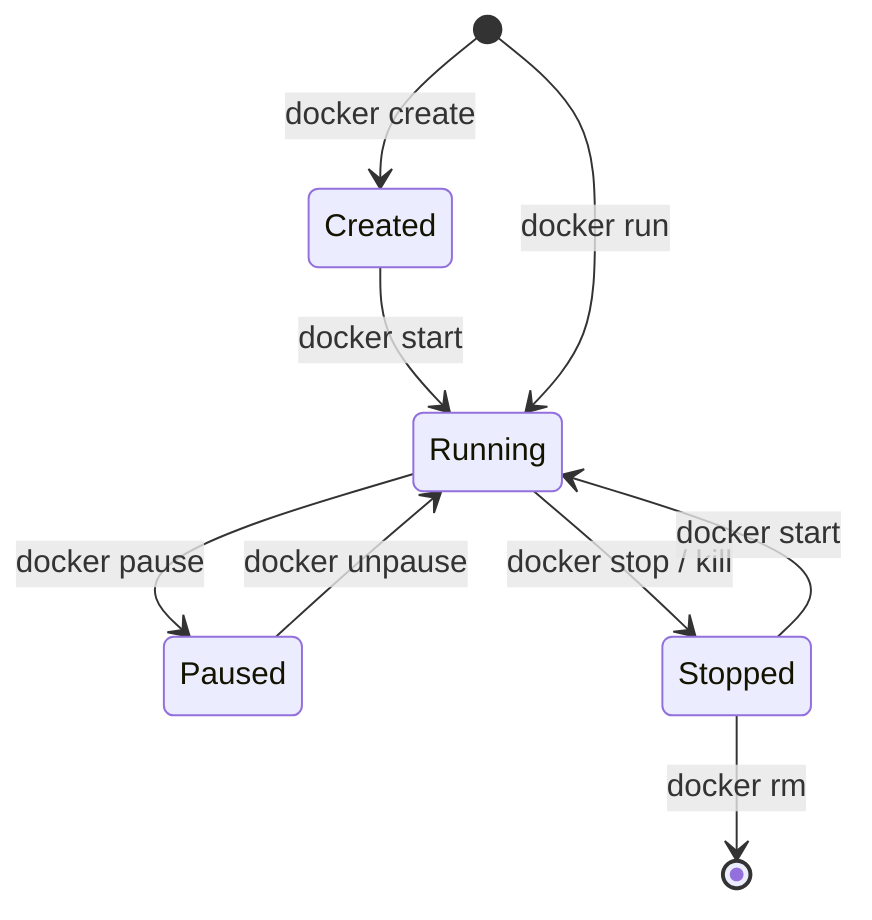

# Docker Container Lifecycle & Commands Cheatsheet

## 1. Container Lifecycle States

A Docker container transitions through several distinct states during its lifespan:

1. **Created**: Image layers are downloaded and writable layer is set up, but the container process hasn't started yet.
2. **Running**: Main process (`CMD` or `ENTRYPOINT`) is active and executing.
3. **Paused**: All processes in the container are temporarily suspended using Linux cgroups.
4. **Stopped / Exited**: Main process has exited or was terminated via `SIGTERM` / `SIGKILL`.
5. **Removed / Destroyed**: The container configuration and writable layer are permanently deleted.

---

## 2. Essential Docker Commands

### Image Commands
| Command | Description |
| :--- | :--- |
| `docker build -t <image-name>:<tag> .` | Build an image from a Dockerfile in the current directory |
| `docker images` or `docker image ls` | List all local images |
| `docker pull <image-name>` | Download an image from Docker Hub / registry |
| `docker rmi <image-id>` | Remove a local image |
| `docker image prune -a` | Remove all unused images |

### Container Lifecycle Commands
| Command | Description |
| :--- | :--- |
| `docker run -d --name <name> -p 8080:80 <image>` | Create and run a container in detached (background) mode with port mapping |
| `docker ps` | List all currently running containers |
| `docker ps -a` | List all containers (running and stopped) |
| `docker stop <container-id/name>` | Gracefully stop a running container (`SIGTERM`, then `SIGKILL` after 10s) |
| `docker start <container-id/name>` | Start a stopped container |
| `docker restart <container-id/name>` | Stop and then start a container |
| `docker pause <container-id/name>` | Pause all running processes in the container |
| `docker unpause <container-id/name>` | Resume paused processes |
| `docker kill <container-id/name>` | Forcefully terminate a container immediately (`SIGKILL`) |
| `docker rm <container-id/name>` | Delete a stopped container |
| `docker rm -f <container-id/name>` | Force stop and delete a running container |

### Container Inspection & Execution
| Command | Description |
| :--- | :--- |
| `docker logs <container-name>` | View stdout/stderr logs of a container |
| `docker logs -f --tail 100 <name>` | Follow live logs from the last 100 lines |
| `docker exec -it <name> sh` (or `bash`) | Open an interactive terminal session inside a running container |
| `docker inspect <container-name>` | Output detailed JSON configuration, IP address, health status, and mounts |
| `docker top <container-name>` | Display running processes inside the container |

---

## 3. Docker Compose Commands

Docker Compose simplifies running multi-container applications defined in `docker-compose.yml`:

| Command | Description |
| :--- | :--- |
| `docker compose up -d` | Build, create, and start all services in the background |
| `docker compose up -d --build` | Rebuild images before starting containers |
| `docker compose ps` | Check status, health, and port mappings of all project services |
| `docker compose logs -f` | Stream consolidated logs from all services |
| `docker compose logs -f <service>` | Stream logs from a specific service (e.g., `client` or `server`) |
| `docker compose restart <service>` | Restart a specific service |
| `docker compose stop` | Stop all running services without deleting containers or networks |
| `docker compose down` | Stop and remove containers, networks, and internal resources |
| `docker compose down -v` | Stop containers, remove networks, AND delete persistent volumes |
